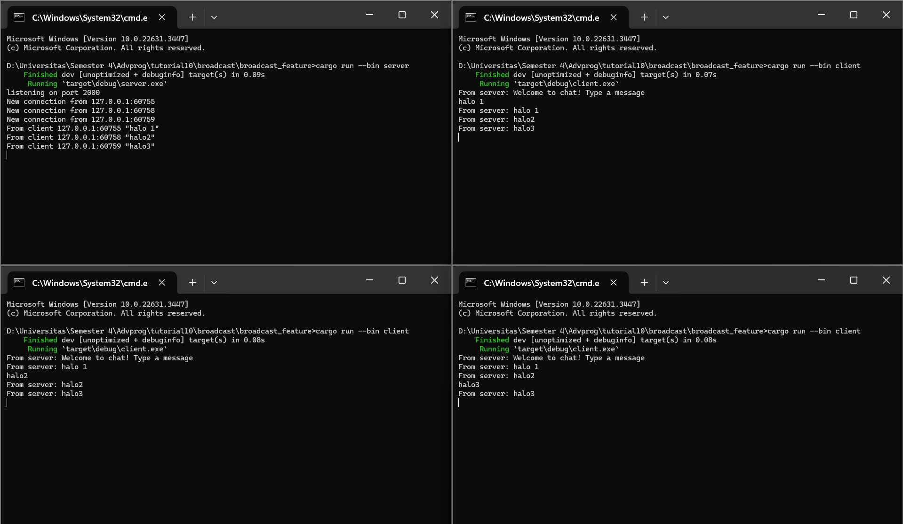
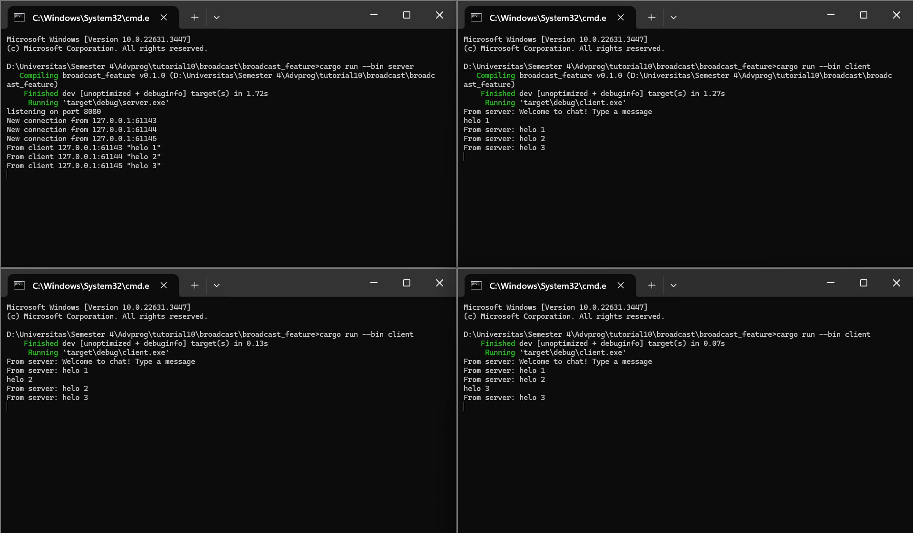
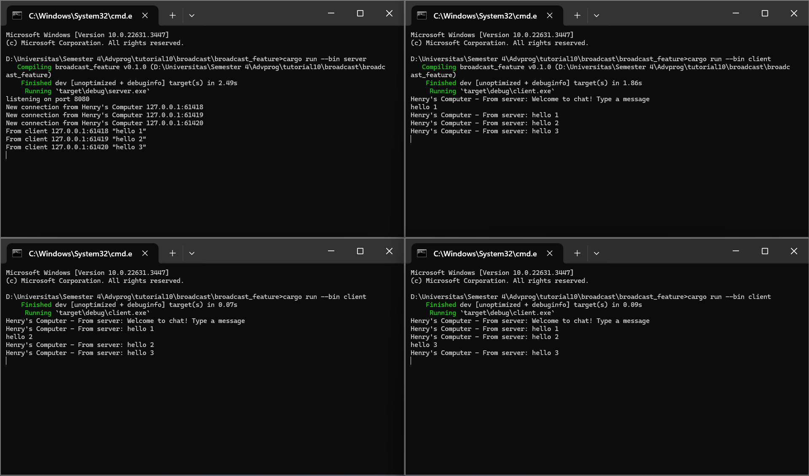

# TUTORIAL 2

## 2.1. Original code of broadcast chat.

Untuk menjalankan program tersebut, langkah pertama adalah membuka empat terminal atau command prompt. Di terminal pertama, jalankan server menggunakan perintah `cargo run --bin server`. Server akan mulai dan siap menerima koneksi dari client. Selanjutnya, buka tiga terminal tambahan untuk menjalankan tiga client dengan perintah `cargo run --bin client`.

Setelah semua client berhasil terhubung ke server, pengguna dapat mulai berinteraksi dengan program. Ketika pengguna mengetikkan pesan di salah satu client dan mengirimkannya, pesan tersebut akan dikirimkan ke server. Server kemudian akan meneruskan pesan tersebut ke semua client yang terhubung. Ini memungkinkan setiap client untuk menerima dan melihat pesan yang dikirim oleh client lainnya.

Contoh interaksi yang terjadi adalah sebagai berikut: jika pengguna mengetikkan pesan di Client 1 dan mengirimkannya, pesan tersebut akan terlihat di terminal server sebagai penerima pesan. Server akan mengirimkan pesan tersebut kembali ke Client 1, Client 2, dan Client 3. Akibatnya, setiap client akan menerima pesan yang dikirim oleh client lainnya, dan pesan tersebut juga akan muncul di terminal server sebagai perantara komunikasi.

Dengan demikian, program ini memfasilitasi komunikasi antara client yang terhubung melalui server sebagai perantara. Pesan-pesan yang dikirim dari satu client akan diterima oleh semua client lainnya, memungkinkan interaksi dan pertukaran informasi antara pengguna yang menggunakan aplikasi ini.

## 2.2. Modifying the websocket port

Untuk menjalankan program, clone repositori dan jalankan server dengan cargo run --bin server. By default, server akan mendengarkan koneksi WebSocket pada port 2000. Jika ingin mengubah port server menjadi 8080, kita dapat memodifikasi konfigurasi port dalam kode server sebelum melakukan kompilasi dan menjalankan ulang server. Selanjutnya, jalankan beberapa client dengan cargo run --bin client di terminal terpisah untuk menghubungkan ke server. Setelah semua client terhubung, Anda dapat berinteraksi dengan program chat dengan mengetik dan mengirim pesan di terminal client. Pesan yang dikirim akan diterima oleh semua client yang terhubung. Program ini memanfaatkan tokio_websockets untuk mengimplementasikan koneksi WebSocket secara asinkron di atas runtime Tokio. Jika tertarik berkontribusi, fork repositori ini dan ajukan perbaikan atau peningkatan melalui pull request.

## 2.3. Small changes. Add some information to client

Perubahan yang saya lakukan pada commit kali ini bertujuan untuk menambahkan fungsionalitas yang memungkinkan loop ini secara bersamaan mendengarkan pesan-pesan masuk dari aliran WebSocket dan input dari standar input. Hal ini memungkinkan program untuk merespons pesan-pesan WebSocket dan input pengguna secara asinkron. Penambahan teks ini sebagai bagian dari mekanisme logging atau debugging bertujuan untuk memvisualisasikan pesan-pesan yang diterima dari server. Dengan menambahkan awalan "Henry's Komputer - Dari server: " pada setiap pesan, memudahkan untuk membedakan pesan dari server dengan jenis pesan lainnya, terutama dalam situasi di mana ada banyak sumber pesan yang dikirim.

Dalam file server.rs, loop ini menerima koneksi masuk, membuat tugas asinkron baru untuk menangani setiap koneksi, dan kemudian mengulangi proses tersebut secara terus-menerus. Setiap tugas yang dibuat menangani satu koneksi, memungkinkan server untuk mengelola banyak koneksi bersamaan dengan efisien. Server di sini akan menerima koneksi masuk dan mencetak informasi localhost dan port bersamaan dengan koneksi tersebut.